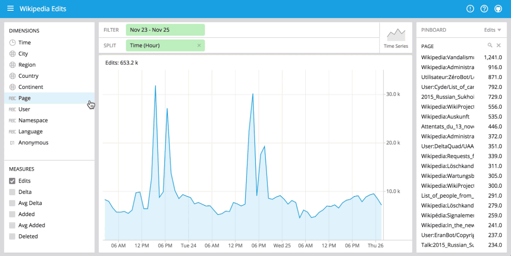
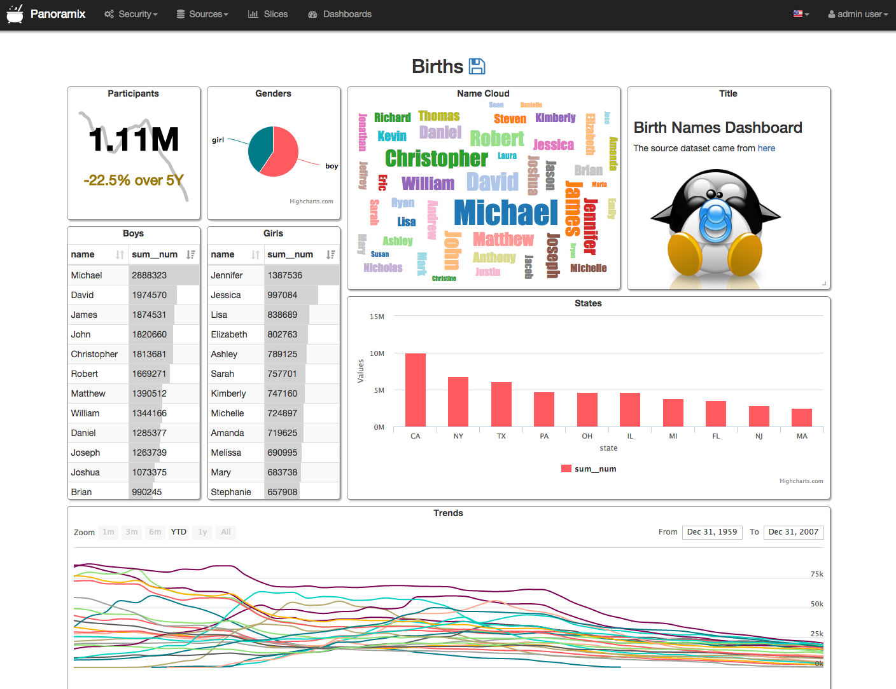

# Intro

## Experience

- Real Time Social Media Analytics

## Real Time?

- Ingestion Latency: seconds
- Query Latency: seconds

## Demand

- Twitter: `20k msg/s`, `1msg = 10ko`  during 24h
- Facebook public: 1000 to 2000 msg/s continuously

## Reality

- Twitter: 400 msg/s continuously, burst to 1500
- Facebook: 1000 to 2000 msg/s

## Origin (PHP)

\  

## Refactoring

- Haskell
- Clojure / Clojurescript
- Kafka / Zookeeper
- Mesos / Marathon
- **Druid**

## Demo

- Low Latency High Volume of Data Analysis
- Typically `pulse`

<a href="http://pulse.vigiglo.be/#/vigiglobe/Earthquake/dashboard" target="_blank">
DEMO Time
</a>

# Pre Considerations

## Discovered vs Invented

Try to conceptualize

Scalable + Real Time + Fail safe

- timeseries
- alerting system
- top N
- etc...

## In the End

Druid concepts are always emerging naturally

# Druid

## Who?

Metamarkets

[Powered by Druid](http://druid.io/druid-powered.html)

- Alibaba, Cisco, Criteo, eBay, Hulu, Netflix, Paypal...

## Goal

> Druid is an open source store designed for
> real-time exploratory analytics on large data sets.

> hosted dashboard that would allow users to
> arbitrarily explore and visualize event streams.

## Concepts

- Column-oriented storage layout
- distributed, shared-nothing architecture
- advanced indexing structure

## Key Features

- Sub-second OLAP Queries
- Real-time Streaming Ingestion
- Power Analytic Applications
- Cost Effective
- High Available
- Scalable

## Right for me?

- require fast aggregations
- exploratory analytics
- analysis in real-time
- lots of data (trillions of events, petabytes of data)
- no single point of failure

# High Level Architecture

## Inspiration

- Google's [BigQuery/Dremel](http://static.googleusercontent.com/media/research.google.com/en/us/pubs/archive/36632.pdf)
- Google's [PowerDrill](http://vldb.org/pvldb/vol5/p1436_alexanderhall_vldb2012.pdf)

## Index / Immutability

Druid indexes data to create mostly immutable views.

## Storage

Store data in custom column format highly optimized for aggregation & filter.

## Specialized Nodes

- A Druid cluster is composed of various type of nodes
- Each designed to do a small set of things very well
- Nodes don't need to be deployed on individual hardware
- Many node types can be colocated in production

# Druid vs X

## Elasticsearch

- resource requirement much higher for ingestion & aggregation
- No data summarization (100x in real world data)

## Key/Value Stores (HBase/Cassandra/OpenTSDB)

- Must Pre-compute Result
    - Exponential storage
    - Hours of pre-processing time
- Use the dimensions as key (like in OpenTSDB)
    - No filter index other than range
    - Hard for complex predicates

## Spark

- Druid can be used to accelerate OLAP queries in Spark
- Druid focuses on the latencies to ingest and serve queries
- Too long for end user to arbitrarily explore data

## SQL-on-Hadoop (Impala/Drill/Spark SQL/Presto)

- Queries: more data transfer between nodes
- Data Ingestion: bottleneck by backing store
- Query Flexibility: more flexible (full joins)

# Data

## Concepts

- **Timestamp column**: query centered on time axis
- **Dimension columns**: strings (used to filter or to group)
- **Metric columns**: used for aggregations (count, sum, mean, etc...)

# Roll-up

## from

~~~
timestamp             publisher          advertiser  gender  country  click  price
2011-01-01T01:01:35Z  bieberfever.com    google.com  Male    USA      0      0.65
2011-01-01T01:03:63Z  bieberfever.com    google.com  Male    USA      0      0.62
2011-01-01T01:04:51Z  bieberfever.com    google.com  Male    USA      1      0.45
2011-01-01T01:00:00Z  ultratrimfast.com  google.com  Female  UK       0      0.87
2011-01-01T02:00:00Z  ultratrimfast.com  google.com  Female  UK       0      0.99
2011-01-01T02:00:00Z  ultratrimfast.com  google.com  Female  UK       1      1.53
~~~

## to

~~~
timestamp             publisher          advertiser  gender country impressions clicks revenue
2011-01-01T01:00:00Z  ultratrimfast.com  google.com  Male   USA     1800        25     15.70
2011-01-01T01:00:00Z  bieberfever.com    google.com  Male   USA     2912        42     29.18
2011-01-01T02:00:00Z  ultratrimfast.com  google.com  Male   UK      1953        17     17.31
2011-01-01T02:00:00Z  bieberfever.com    google.com  Male   UK      3194        170    34.01
~~~

## as SQL

~~~
GROUP BY timestamp
       , publisher , advertiser , gender , country
  :: impressions = COUNT(1)
  ,  clicks = SUM(click)
  ,  revenue = SUM(price)
~~~

In practice can dramatically reduce the size (up to x100)

# Sharding

## Segments

Segment sampleData_2011-01-01T01:00:00:00Z_2011-01-01T02:00:00:00Z_v1_0 contains

~~~
2011-01-01T01:00:00Z  ultratrimfast.com  google.com  Male   USA     1800        25     15.70
2011-01-01T01:00:00Z  bieberfever.com    google.com  Male   USA     2912        42     29.18
~~~

Segment sampleData_2011-01-01T02:00:00:00Z_2011-01-01T03:00:00:00Z_v1_0 contains

~~~
2011-01-01T02:00:00Z  ultratrimfast.com  google.com  Male   UK      1953        17     17.31
2011-01-01T02:00:00Z  bieberfever.com    google.com  Male   UK      3194        170    34.01
~~~

## Core Data Structure

\  

- dictionary
- a bitmap for each value
- a list of the columns values encoded using the dictionary

## Dictionary

~~~
{ "Justin Bieber": 0
, "Ke$ha": 1
}
~~~

## Columnn Data

~~~
[ 0
, 0
, 1
, 1
]
~~~

## Bitmaps

one for each value of the column

~~~
value="Justin Bieber": [1,1,0,0]
value="Ke$ha": [0,0,1,1]
~~~

# Data

## Indexing Data

- Immutable snapshots of data
- data structure highly optimized for analytic queries
- Each column is stored separately
- Indexes data on a per shard (segment) level

## Loading data

- Real-Time 
- Batch

## Querying the data

- JSON over HTTP
- Single Table Operations, no joins.

## Columnar Storage

## Index

- Values are dictionary encoded

`{"USA" 1, "Canada" 2, "Mexico" 3, ...}`

- Bitmap for every dimension value (used by filters)

`"USA" -> [0 1 0 0 1 1 0 0 0]`

- Column values (used by aggergation queries)

`[2,1,3,15,1,1,2,8,7]`

## Data Segments

- Per time interval
    - skip segments when querying
- Immutable
    - Cache friendly
    - No locking
- Versioned
    - No locking
    - Read-write concurrency
  
## Real-time ingestion

- Via Real-Time Node and Firehose
    - No redundancy or HA, thus not recommended
- Via Indexing Service and Tranquility API
    - Core API
    - Integration with Streaming Frameworks
    - HTTP Server
    - **Kafka Consumer**

## Batch Ingestion

- File based (HDFS, S3, ...)

## Real-time Ingestion

~~~
Task 1: [   Interval   ][ Window ]
Task 2:                 [              ]
--------------------------------------->
                                time
~~~

Minimum indexing slots =  
  Data Sources × Partitions × Replicas × 2

# Querying

## Query types

- Group by: group by multiple dimensions
- Top N: like grouping by a single dimension
- Timeseries: without grouping over dimensions
- Search: Dimensions lookup
- Time Boundary: Find available data timeframe
- Metadata queries

## Tip

- Prefer `topN` over `groupBy`
- Prefer `timeseries` over `topN`
- Use limits (and priorities)

## Query Spec

- Data source
- Dimensions
- Interval
- Filters
- Aggergations
- Post Aggregations
- Granularity
- Context (query configuration)
- Limit

## Example(s)

TODO

## Caching

- Historical node level
    - By segment
- Broker Level
    - By segment and query
    - `groupBy` is disabled on purpose!
- By default - local caching

## Load Rules

- Can be defined
- What can be set

# Components

## Druid Components

- Real-time Nodes
- Historical Nodes
- Broker Nodes
- Coordinator
- For indexing:
    - Overlord
    - Middle Manager

+ Deep Storage
+ Metadata Storage

+ Load Balancer
+ Cache

## Coordinator

Manage Segments

## Real-time Nodes

- Pulling data in real-time
- Indexing it

## Historical Nodes

- Keep historical segments

## Overlord

- Accepts tasks and distributes them to middle manager

## Middle Manager

- Execute submitted tasks via Peons

## Broker Nodes

- Route query to Real-time and Historical nodes
- Merge results

## Deep Storage

- Segments backup (HDFS, S3, ...)

# Considerations & Tools

## When *not* to choose Druid

- Data is not time-series
- Cardinality is _very_ high
- Number of dimensions is high
- Setup cost must be avoided

## Graphite (metrics)

\__

[Graphite](http://graphite.wikidot.com)

## Pivot (exploring data)

\  

[Pivot](https://github.com/implydata/pivot)

## Caravel (exploring data)

\  

[Caravel](https://github.com/airbnb/caravel)
