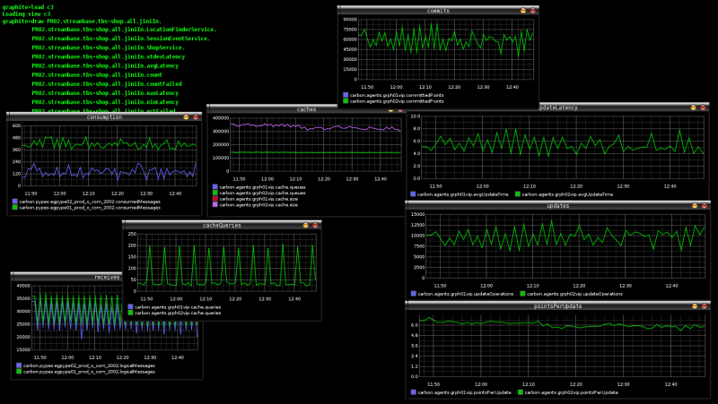

# Intro

## Plan

- Introduction; why?
- How?

## Experience

- Real Time Social Media Analytics

## Real Time?

- Ingestion Latency: seconds
- Query Latency: seconds

## Demande

- Twitter: `20k msg/s`, `1msg = 10ko`  pendant 24h
- Facebook public: 1000 à 2000 msg/s en continu

## En pratique

- Twitter: 400 msg/s en continu, pics à 1500

## Origine (PHP)

\  

## Introduction

- Traitement de donnée gros volume + faible latence
- Typiquement `pulse`

<a href="http://pulse.vigiglo.be/#/vigiglobe/Earthquake/dashboard" target="_blank">
DEMO
</a>

## Pre Considerations

Discovered vs Invented

## Try to conceptualize (events)

Scalable + Real Time + Fail safe

- timeseries
- alerting system
- top N
- etc...

## In the End

Druid concepts are always emerging naturally

# Druid

## Who

Metamarkets

## Goal

> Druid is an open source store designed for
> real-time exploratory analytics on large data sets.

> hosted dashboard that would allow users to
> arbitrarily explore and visualize event streams.

## Concepts

- Column-oriented storage layout
- distributed, shared-nothing architecture
- advanced indexing structure

## Features

- fast aggregations
- flexible filters
- low latency data ingestion

**arbitrary exploration of billion-row tables tables with sub-second latencies**

## Storage

- Columnar
- Inverted Index
- Immutable Segments

## Columnar Storage

## Index

- Values are dictionary encoded

`{"USA" 1, "Canada" 2, "Mexico" 3, ...}`

- Bitmap for every dimension value (used by filters)

`"USA" -> [0 1 0 0 1 1 0 0 0]`

- Column values (used by aggergation queries)

`[2,1,3,15,1,1,2,8,7]`

## Data Segments

- Per time interval
  - skip segments when querying
- Immutable
  - Cache friendly
  - No locking
- Versioned
  - No locking
  - Read-write concurrency
  
## Real-time ingestion

- Via Real-Time Node and Firehose
  - No redundancy or HA, thus not recommended
- Via Indexing Service and Tranquility API
  - Core API
  - Integration with Streaming Frameworks
  - HTTP Server
  - **Kafka Consumer**

## Batch Ingestion

- File based (HDFS, S3, ...)

## Real-time Ingestion

~~~
Task 1: [   Interval   ][ Window ]
Task 2:                 [              ]
--------------------------------------->
                                time
~~~

Minimum indexing slots =  
  Data Sources × Partitions × Replicas × 2

# Querying

## Query types

- Group by: group by multiple dimensions
- Top N: like grouping by a single dimension
- Timeseries: without grouping over dimensions
- Search: Dimensions lookup
- Time Boundary: Find available data timeframe
- Metadata queries

## Tip

- Prefer `topN` over `groupBy`
- Prefer `timeseries` over `topN`
- Use limits (and priorities)

## Query Spec

- Data source
- Dimensions
- Interval
- Filters
- Aggergations
- Post Aggregations
- Granularity
- Context (query configuration)
- Limit

## Example(s)

TODO

## Caching

- Historical node level
  - By segment
- Broker Level
  - By segment and query
  - `groupBy` is disabled on purpose!
- By default - local caching

## Load Rules

- Can be defined
- What can be set

# Components

## Druid Components

- Real-time Nodes
- Historical Nodes
- Broker Nodes
- Coordinator
- For indexing:
  - Overlord
  - Middle Manager

+ Deep Storage
+ Metadata Storage

+ Load Balancer
+ Cache

## Coordinator

Manage Segments

## Real-time Nodes

- Pulling data in real-time
- Indexing it

## Historical Nodes

- Keep historical segments

## Overlord

- Accepts tasks and distributes them to middle manager

## Middle Manager

- Execute submitted tasks via Peons

## Broker Nodes

- Route query to Real-time and Historical nodes
- Merge results

## Deep Storage

- Segments backup (HDFS, S3, ...)

# Considerations & Tools

## When *not* to choose Druid

- Data is not time-series
- Cardinality is _very_ high
- Number of dimensions is high
- Setup cost must be avoided

## Graphite (metrics)

\__

[Graphite](http://graphite.wikidot.com)

## Pivot (exploring data)

\  

[Pivot](https://github.com/implydata/pivot)

## Caravel (exploring data)

\  

[Caravel](https://github.com/airbnb/caravel)
